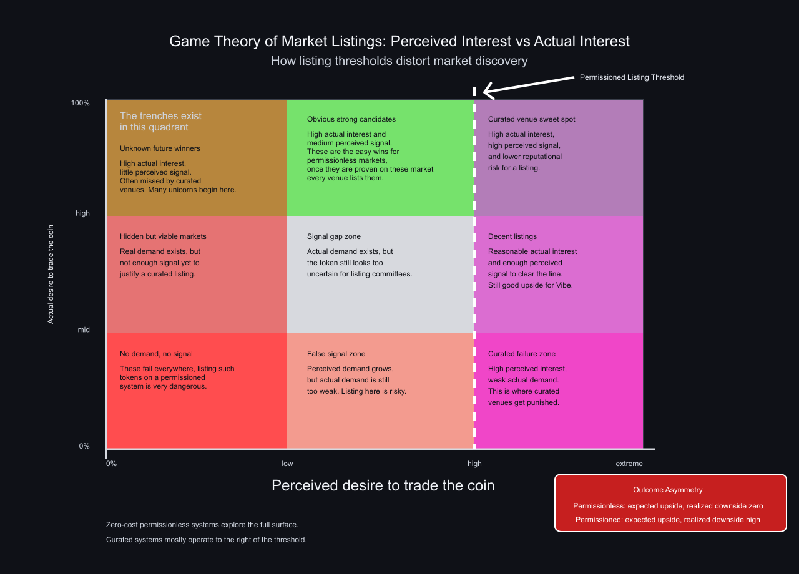

# Perceived vs Actual Interest

The core distinction in the game theory of listings is between **perceived interest** and **actual interest**.

**Figure takeaway:** the most important region is often left of the listing threshold. That is where actual future demand may be real, but the perceived signal is still too weak for curated venues to justify taking the risk.

**Actual interest** means what the market really does once the asset is live:

- how much real buying power appears
- how much real selling pressure exists
- whether traders keep returning
- whether the asset becomes culturally or financially relevant

The problem is that none of this can be known with certainty in advance.

Before a token is listed, every exchange or listing committee is stuck with prediction. It can estimate, model, infer, and rank. But it cannot observe the thing itself because the market has not yet been allowed to form. Actual interest is only measurable after the information has been created by the market process.

That means any authority deciding on a listing must use substitutes:

- community size
- social engagement
- deposits or fees
- volume expectations
- narrative momentum
- institutional credibility

These may be useful heuristics, but they are still heuristics. And once they become important, projects begin optimizing for them. The system gradually shifts from discovering genuine demand to rewarding signals that look like demand.

This is the key epistemic limit at the center of the paper: **actual interest is evolutionary and revealed over time; perceived interest is administrative and guessed ahead of time**.

Curated listing systems do not fail because their participants are malicious. They fail because they must act under uncertainty while bearing downside for being wrong.

---

[← Introduction](01-Introduction.md) | [Next: The Cost of Curation →](03-The-Cost-of-Curation.md)
